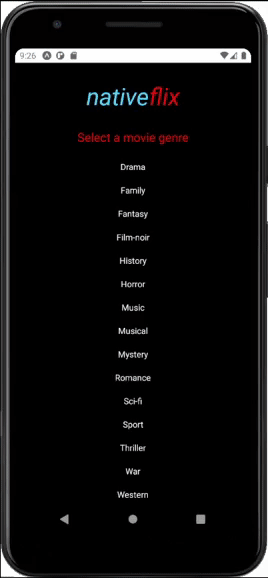

# nativeflix

This is an app that gathers movie data from the [YIFY api](https://yts.mx/api), generating a list of movies based on the selected genre. It connects to your pc through sockets using the [nativeflix-server](https://github.com/msmaiaa/nativeflix-server), creating the possibility to download the torrent provided by the api or stream it to VLC. I used expo because i wanted to test it on ios and android without having a mac. More info [here](https://github.com/msmaiaa/nativeflix-server).

## Preview




## Installation

Use the package manager [npm](https://www.npmjs.com/) to install expo.

```bash
npm install --global expo-cli
npm install
```

## Usage

Open config.json, put the local ip of the machine that is running the server and the port of preference (use the same on the server). Just like the example below.  
If you don't know how to find the local ip, click here: [help](https://lifehacker.com/how-to-find-your-local-and-external-ip-address-5833108#:~:text=Open%20up%20the%20Command%20Prompt,is%20your%20local%20IP%20address.)
```json
{
    "ip": "192.168.0.10",
    "port": "1337"
}
```

Use this to start the app.
```bash
expo start
```

## Contributing
Pull requests are welcome. For major changes, please open an issue first to discuss what you would like to change.

## License
[here](https://github.com/msmaiaa/nativeflix/blob/main/LICENSE)

## TODO
- [ ] Change the player to electron instead of VLC
- [ ] Clean the code
- [ ] Search movies by name
- [ ] Order by imdb rating or download count
- [ ] 'I'm feeling lucky' button
- [ ] Search for the server on the local network ips
